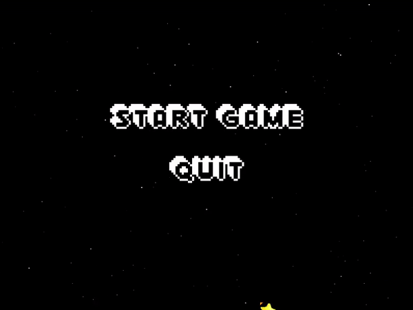

# PONG Game in Python

This is a classic Pong game built in Python using the `pygame` library. It features a simple, fun gameplay experience and showcases the following features:
- **Game Menu**: Start or quit the game from the main menu.
- **Gameplay**: Two paddles and a bouncing ball, with a competitive objective to keep the ball from going out of bounds.
- **Score Tracking**: Counts the number of times each player hits the ball during gameplay.
- **Game Over Screen**: Displays the winner and the total number of hits made by the winner.
- **Restart or Quit**: Players can restart the game or exit after the game ends.

## Demo


## Features
1. **Main Menu**:
   - Options: "Start Game" and "Quit".

2. **Pong Gameplay**:
   - Classic Pong mechanics: Two paddles and a bouncing ball.
   - Player 1 (left paddle) controls: `W` (up) and `S` (down).
   - Player 2 (right paddle) controls: `UP ARROW` (up) and `DOWN ARROW` (down).

3. **Dynamic Scoring**:
   - Tracks how many times each player successfully hits the ball.

4. **Game Over Screen**:
   - Displays the winning player and their total hits.
   - Options: "Restart Game" or "Quit".

5. **Replayability**:
   - Restart the game easily from the "Game Over" screen.

## Installation

1. Clone the repository:
   ```bash
   git clone https://github.com/yourusername/pong-game-python.git
   cd pong-game-python
   ```

2. Install dependencies:
   ```bash
   pip install pygame
   ```

3. Run the game:
   ```bash
   python main.py
   ```

## Controls
- **Player 1 (Left Paddle)**:
  - `W` - Move up
  - `S` - Move down
- **Player 2 (Right Paddle)**:
  - `UP ARROW` - Move up
  - `DOWN ARROW` - Move down
- **Menu Navigation**:
  - Click on options to select.

## Project Structure
```bash
pong-game-python/
├── src/
│   ├── main.py          # Main game loop
│   ├── paddle.py        # Paddle class 
│   ├── ball.py          # Ball class 
│   ├── menu.py          # Menu class
│   ├── game_over.py     # GameOver class 
├── README.md            
└── .gitignore           

```

## Future Improvements
This project is a work in progress, with the goal of learning! :)